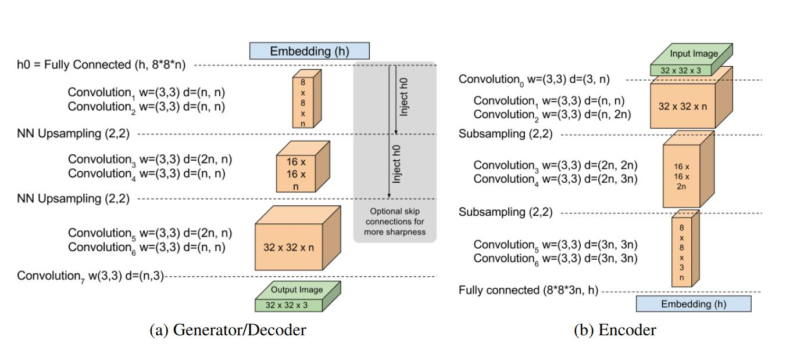

<p align="center">
  
</p>


## BEGAN (Boundary Equilibrium GAN)

### Purpose

BEGAN is a generative adversarial network (GAN) that aims to solve the mode collapse problem common in GAN training. It introduces a novel loss function to encourage the generator to produce diverse samples that cover the data distribution more effectively. This project replicates the original [paper](http://arxiv.org/pdf/1703.10717)

### Features

* **Boundary Equilibrium Loss:** BEGAN utilizes a loss function that measures the balance between the real and fake data distributions at the boundaries of the data space.
* **Improved Sample Diversity:** By encouraging the generator to produce samples that explore the data boundaries, BEGAN promotes diversity and prevents mode collapse.
* **Hyperparameter-Free Training:** Unlike traditional GANs that require careful hyperparameter tuning, BEGAN automatically adjusts its behavior based on the data distribution, making it easier to train.

### Technologies Used

* PyTorch
* Numpy
* CUDA

### Getting Started

**1. Clone the Repository**

```bash
git clone https://github.com/vimmoos/BE_GAN.git
```

**2. Install Dependencies**


```bash
cd began
pip install -r req.txt
```

Moreover, this project uses `wandb`. Therefore you need to have an wandb account  and you need to be logged in. To login use `wandb login`.

**3. Prepare Data**

Download the CelebA dataset from here [link](http://mmlab.ie.cuhk.edu.hk/projects/CelebA.html). You will probably download a file named `img_align_celeba`.Unzip it into the `data/` directory and rename the extracted folder to `celeba`

Then run the following command from the root folder of the project:

```bash
python data/face_detect.py
```

This will perform the necessary preprocessing.

**4. Train**

Simply run the following python command from the root folder:

```bash
python -m began.main
```

In order to change the parameters either use wandb or change the default on in the `began/main.py` file.


**5. Generation**

```bash
python -m began.generate
```
This will generate a series of images that were generated from the model during different phases of the training.
